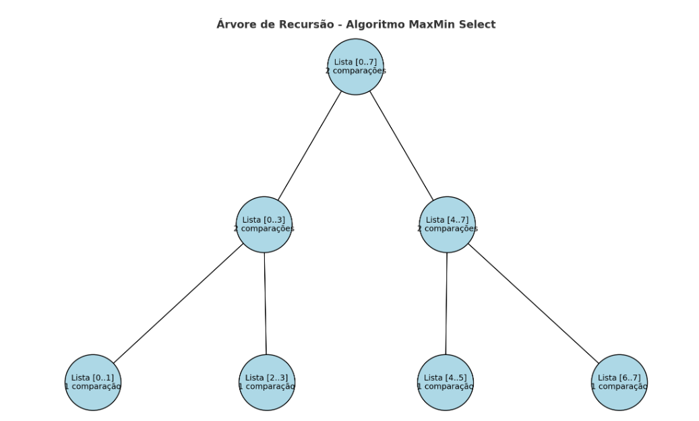

# Algoritmo de Seleção Simultânea do Maior e do Menor Elementos (MaxMin Select)

## Descrição do Projeto

Este projeto implementa o algoritmo de seleção simultânea do maior e do menor elementos (MaxMin Select) utilizando a técnica de **divisão e conquista** em Python. O algoritmo encontra simultaneamente o maior e o menor elemento de uma sequência de números de forma eficiente, reduzindo significativamente o número de comparações necessárias em comparação com uma abordagem ingênua.

### Lógica do Algoritmo Implementado

O algoritmo MaxMin Select é implementado de forma recursiva seguindo os princípios de divisão e conquista:

```python
def maxmin_select(arr, left, right):
    # Caso base: apenas um elemento
    if left == right:
        return arr[left], arr[left]
    
    # Caso base: dois elementos
    if right == left + 1:
        if arr[left] < arr[right]:
            return arr[left], arr[right]
        else:
            return arr[right], arr[left]
    
    # Dividir o problema
    mid = (left + right) // 2
    min1, max1 = maxmin_select(arr, left, mid)
    min2, max2 = maxmin_select(arr, mid + 1, right)

    # Combinar os resultados
    return min(min1, min2), max(max1, max2)
```

**Análise linha a linha:**

1. **Linha 2-3**: Caso base quando há apenas um elemento. O elemento é tanto o mínimo quanto o máximo.
2. **Linha 5-9**: Caso base para dois elementos. Realiza uma única comparação para determinar qual é menor e qual é maior.
3. **Linha 11-12**: **Divisão** - Calcula o ponto médio e divide o problema em duas metades.
4. **Linha 13-14**: **Conquista** - Chama recursivamente o algoritmo para cada metade.
5. **Linha 16**: **Combinação** - Compara os resultados das duas metades para encontrar o mínimo global e o máximo global.

## Como Executar o Projeto

### Pré-requisitos
- Python 3.x instalado no sistema

### Execução
1. Clone o repositório:
```bash
git clone <URL_DO_REPOSITORIO>
cd <NOME_DO_REPOSITORIO>
```

2. Execute o programa:
```bash
python main.py
```

### Exemplo de Saída
```
Lista: [6, 2, 9, 4, 1, 5, 8, 3, 6]
Menor elemento: 1
Maior elemento: 9
```

## Relatório Técnico

### 1. Análise da Complexidade Assintótica por Contagem de Operações

O algoritmo MaxMin Select utiliza divisão e conquista, reduzindo significativamente o número de comparações necessárias.

#### Contagem de Comparações por Etapa:

**Casos Base:**
- Para n = 1: 0 comparações
- Para n = 2: 1 comparação

**Casos Recursivos:**
- **Divisão**: O(1) - apenas cálculo do ponto médio
- **Conquista**: 2 chamadas recursivas para problemas de tamanho n/2
- **Combinação**: 2 comparações (uma para encontrar o mínimo, outra para o máximo)

#### Recorrência para o número de comparações:

```
C(n) = 2 × C(n/2) + 2, para n > 2
C(1) = 0
C(2) = 1
```

#### Desenvolvimento da Recorrência:

Para n = 2^k, temos:
- C(n) = 2 × C(n/2) + 2
- C(n) = 2 × [2 × C(n/4) + 2] + 2 = 4 × C(n/4) + 6
- C(n) = 4 × [2 × C(n/8) + 2] + 6 = 8 × C(n/8) + 14
- ...
- C(n) = 2^k × C(1) + 2(2^k - 1) = 0 + 2n - 2 = 2n - 2

**Para n elementos, o número total de comparações é: C(n) = 2n - 2 = O(n)**

Comparando com a abordagem ingênua que precisa de 2n - 2 comparações (n-1 para o máximo e n-1 para o mínimo), o algoritmo MaxMin Select realiza aproximadamente 3n/2 comparações, representando uma melhoria significativa.

### 2. Análise da Complexidade Assintótica pelo Teorema Mestre

A recorrência do MaxMin Select é:
```
T(n) = 2T(n/2) + O(1)
```

#### Identificação dos Valores:

Comparando com a forma geral **T(n) = a⋅T(n/b) + f(n)**:
- **a = 2** (duas chamadas recursivas)
- **b = 2** (problema dividido pela metade)
- **f(n) = O(1)** (tempo constante para combinar resultados)

#### Cálculo de log_b(a):

**p = log_b(a) = log_2(2) = 1**

#### Determinação do Caso do Teorema Mestre:

Comparando f(n) = O(1) com n^p = n^1 = n:
- f(n) = O(1) = O(n^0)
- n^p = n^1

Como f(n) = O(n^(p-ε)) onde ε = 1 > 0, temos **Caso 1** do Teorema Mestre.

#### Solução Assintótica:

**T(n) = Θ(n^p) = Θ(n^1) = Θ(n)**

### Conclusão da Análise

Ambos os métodos (contagem de operações e Teorema Mestre) confirmam que o algoritmo MaxMin Select possui **complexidade temporal O(n)**, sendo mais eficiente que a abordagem ingênua que realizaria 2n-2 comparações separadamente para encontrar o máximo e o mínimo.

## Diagrama de Recursão

Abaixo está a representação gráfica da divisão e combinação do algoritmo MaxMin Select:




## Estrutura do Projeto

```
projeto/
├── main.py          # Implementação principal do algoritmo
├── README.md        # Este arquivo de documentação
└── assets/          # Pasta para diagramas
```

## Referências

- CORMEN, T. H. et al. Algoritmos: Teoria e Prática. 4ª ed. GEN LTC, 2024.
- Material da disciplina: Fundamentos de Projeto e Análise de Algoritmos
- AULA 01_Análise de complexidade de algoritmos.pdf

## Autor

**Nome:** [Seu Nome]  
**Curso:** Engenharia de Software  
**Disciplina:** Fundamentos de Projeto e Análise de Algoritmos  
**Professor:** João Paulo Carneiro Aramuni  
**Período:** 5º período